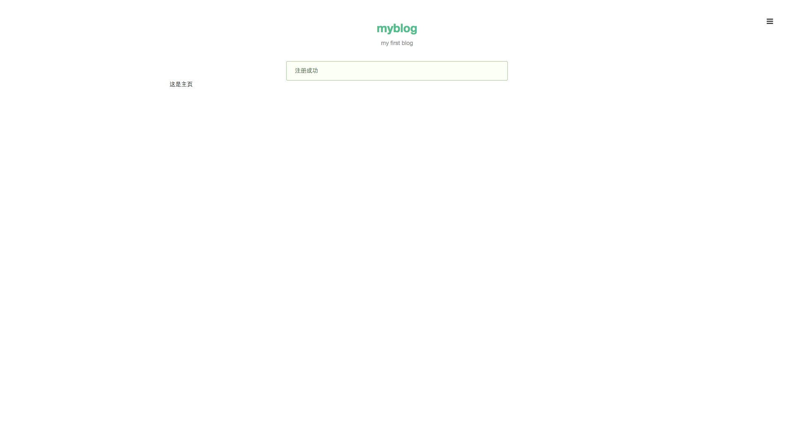

## 4.7.1 用户模型设计

我们只存储用户的名称、密码（加密后的）、头像、性别和个人简介这几个字段，对应修改 lib/mongo.js，添加如下代码：

**lib/mongo.js**

```
exports.User = mongolass.model('User', {
  name: { type: 'string' },
  password: { type: 'string' },
  avatar: { type: 'string' },
  gender: { type: 'string', enum: ['m', 'f', 'x'] },
  bio: { type: 'string' }
});
exports.User.index({ name: 1 }, { unique: true }).exec();// 根据用户名找到用户，用户名全局唯一
```

我们定义了用户表的 schema，生成并导出了 User 这个 model，同时设置了 name 的唯一索引，保证用户名是不重复的。

> 小提示：关于 Mongolass 的 schema 的用法，请查阅 [another-json-schema](https://github.com/nswbmw/another-json-schema)。

> 小提示：Mongolass 中的 model 你可以认为相当于 mongodb 中的 collection，只不过添加了插件的功能。

## 4.7.2 注册页

首先，我们来完成注册。新建 views/signup.ejs，添加如下代码：

**views/signup.ejs**

```
<%- include('header') %>

<div class="ui grid">
  <div class="four wide column"></div>
  <div class="eight wide column">
    <form class="ui form segment" method="post" enctype="multipart/form-data">
      <div class="field required">
        <label>用户名</label>
        <input placeholder="用户名" type="text" name="name">
      </div>
      <div class="field required">
        <label>密码</label>
        <input placeholder="密码" type="password" name="password">
      </div>
      <div class="field required">
        <label>重复密码</label>
        <input placeholder="重复密码" type="password" name="repassword">
      </div>
      <div class="field required">
        <label>性别</label>
        <select class="ui compact selection dropdown" name="gender">
          <option value="m">男</option>
          <option value="f">女</option>
          <option value="x">保密</option>
        </select>
      </div>
      <div class="field required">
        <label>头像</label>
        <input type="file" name="avatar">
      </div>
      <div class="field required">
        <label>个人简介</label>
        <textarea name="bio" rows="5"></textarea>
      </div>
      <input type="submit" class="ui button fluid" value="注册">
    </form>
  </div>
</div>

<%- include('footer') %>
```

> 注意：form 表单要添加 `enctype="multipart/form-data"` 属性才能上传文件。

修改 routes/signup.js 中获取注册页的路由如下：

**routes/signup.js**

```
// GET /signup 注册页
router.get('/', checkNotLogin, function(req, res, next) {
  res.render('signup');
});
```

现在访问 `localhost:3000/signup` 看看效果吧。

## 4.7.3 注册与文件上传

我们使用 [express-formidable](https://www.npmjs.com/package/express-formidable) 处理 form 表单（包括文件上传）。修改 index.js ，在 `app.use(flash());` 下一行添加如下代码：

**index.js**

```
// 处理表单及文件上传的中间件
app.use(require('express-formidable')({
  uploadDir: path.join(__dirname, 'public/img'),// 上传文件目录
  keepExtensions: true// 保留后缀
}));
```

新建 models/users.js，添加如下代码：

**models/users.js**

```
var User = require('../lib/mongo').User;

module.exports = {
  // 注册一个用户
  create: function create(user) {
    return User.create(user).exec();
  }
};
```

完善处理用户注册的路由，最终修改 routes/signup.js 如下：

**routes/signup.js**

```
var fs = require('fs');
var path = require('path');
var sha1 = require('sha1');
var express = require('express');
var router = express.Router();

var UserModel = require('../models/users');
var checkNotLogin = require('../middlewares/check').checkNotLogin;

// GET /signup 注册页
router.get('/', checkNotLogin, function(req, res, next) {
  res.render('signup');
});

// POST /signup 用户注册
router.post('/', checkNotLogin, function(req, res, next) {
  var name = req.fields.name;
  var gender = req.fields.gender;
  var bio = req.fields.bio;
  var avatar = req.files.avatar.path.split(path.sep).pop();
  var password = req.fields.password;
  var repassword = req.fields.repassword;

  // 校验参数
  try {
    if (!(name.length >= 1 && name.length <= 10)) {
      throw new Error('名字请限制在 1-10 个字符');
    }
    if (['m', 'f', 'x'].indexOf(gender) === -1) {
      throw new Error('性别只能是 m、f 或 x');
    }
    if (!(bio.length >= 1 && bio.length <= 30)) {
      throw new Error('个人简介请限制在 1-30 个字符');
    }
    if (!req.files.avatar.name) {
      throw new Error('缺少头像');
    }
    if (password.length < 6) {
      throw new Error('密码至少 6 个字符');
    }
    if (password !== repassword) {
      throw new Error('两次输入密码不一致');
    }
  } catch (e) {
    // 注册失败，异步删除上传的头像
    fs.unlink(req.files.avatar.path);
    req.flash('error', e.message);
    return res.redirect('/signup');
  }

  // 明文密码加密
  password = sha1(password);

  // 待写入数据库的用户信息
  var user = {
    name: name,
    password: password,
    gender: gender,
    bio: bio,
    avatar: avatar
  };
  // 用户信息写入数据库
  UserModel.create(user)
    .then(function (result) {
      // 此 user 是插入 mongodb 后的值，包含 _id
      user = result.ops[0];
      // 将用户信息存入 session
      delete user.password;
      req.session.user = user;
      // 写入 flash
      req.flash('success', '注册成功');
      // 跳转到首页
      res.redirect('/posts');
    })
    .catch(function (e) {
      // 注册失败，异步删除上传的头像
      fs.unlink(req.files.avatar.path);
      // 用户名被占用则跳回注册页，而不是错误页
      if (e.message.match('E11000 duplicate key')) {
        req.flash('error', '用户名已被占用');
        return res.redirect('/signup');
      }
      next(e);
    });
});

module.exports = router;
```

> 注意：我们使用 sha1 加密用户的密码，sha1 并不是一种十分安全的加密方式，实际开发中可以使用更安全的 [bcrypt](https://www.npmjs.com/package/bcrypt) 或 [scrypt](https://www.npmjs.com/package/scrypt) 加密。
> 注意：注册失败时（参数校验失败或者存数据库时出错）删除已经上传到 public/img 目录下的头像。

为了方便观察效果，我们先创建主页的模板。修改 routes/posts.js 中对应代码如下：

**routes/posts.js**

```
router.get('/', function(req, res, next) {
  res.render('posts');
});
```

新建 views/posts.ejs，添加如下代码：

**views/posts.ejs**

```
<%- include('header') %>
这是主页
<%- include('footer') %>
```

访问 `localhost:3000/signup`，注册成功后如下所示：



上一节：[4.6 连接数据库](https://github.com/nswbmw/N-blog/blob/master/book/4.6%20%E8%BF%9E%E6%8E%A5%E6%95%B0%E6%8D%AE%E5%BA%93.md)

下一节：[4.8 登出与登录](https://github.com/nswbmw/N-blog/blob/master/book/4.8%20%E7%99%BB%E5%87%BA%E4%B8%8E%E7%99%BB%E5%BD%95.md)